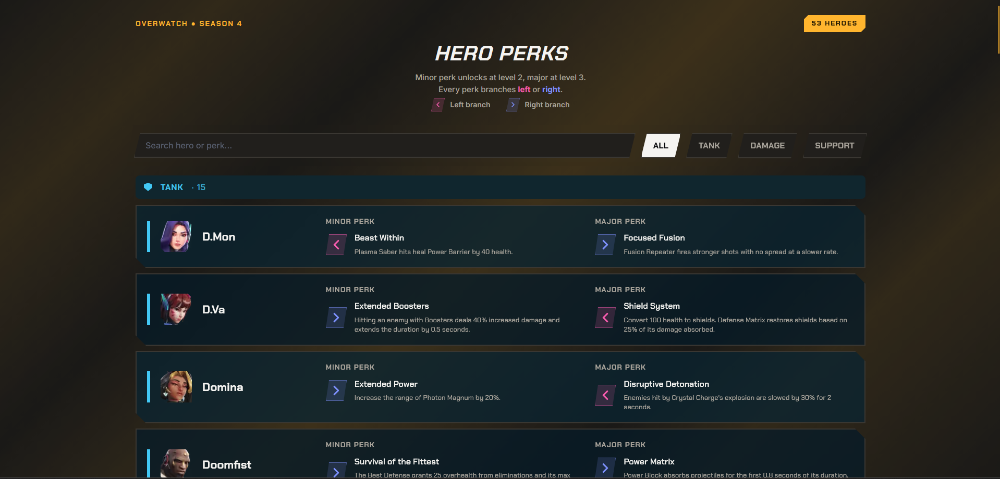

<div align="center">
  
# Overwatch Perks
[](https://github.com/EduardaSRBastos/overwatch-perks?tab=MIT-1-ov-file)
[](https://github.com/EduardaSRBastos/overwatch-perks/actions)
[](https://github.com/EduardaSRBastos/overwatch-perks)

<p><i>A quick guide to Overwatch hero perks.</i></p>

<kbd>  </kbd>

 </div>

<br>

## Table of Contents
- [Features](#features)
- [Data](#data)
- [How to Use](#how-to-use)
- [Contributing](#contributing)
- [License](#license)

<br>

## Features

- **Hero perk reference**: Browse minor and major perks for Overwatch heroes.
- **Role filtering**: Filter heroes by **Tank**, **Damage**, or **Support**.
- **Search**: Search heroes by name or search directly through their perk descriptions.
- **Perk branches**: Clearly distinguishes **Left** and **Right** perk choices with dedicated visual indicators.
- **Responsive design**: Optimized for desktop and mobile screens.
- **Season-aware data**: Currently reflects **Overwatch Season 4** data as of August 2026.

<br>

## Data

Perk data is stored locally in:

```text
assets/heroes.json
```

The page loads this file dynamically when it starts.

Hero portraits are sourced from [owperks.com](https://owperks.com/).

Perk information is sourced from [owperks.com](https://owperks.com/) and [Blizzard's official heroes page](https://overwatch.blizzard.com/en-us/heroes/).

> **Note:** The data reflects Season 4 as of August 2026 and may become outdated as future patches are released. 
> 
> Always verify perk information in-game.

<br>

## How to Use

1. **Step 1**: Open the [Overwatch Heroes Perks website](https://eduardasrbastos.github.io/overwatch-perks/).
2. **Step 2**: Use the **search bar** to find a hero or perk description.
3. **Step 3**: Use the **All**, **Tank**, **Damage**, or **Support** filters to narrow the list.
4. **Step 4**: Check each hero's **Minor Perk** and **Major Perk** columns with the **Left** and **Right** indicators.

<br>

## Contributing
- Support this project by giving it a star ⭐. Thanks!
- Feel free to suggest improvements or report any issues in the repository.

## License
This project is licensed under the MIT License - see the [LICENSE](LICENSE) file for details.
